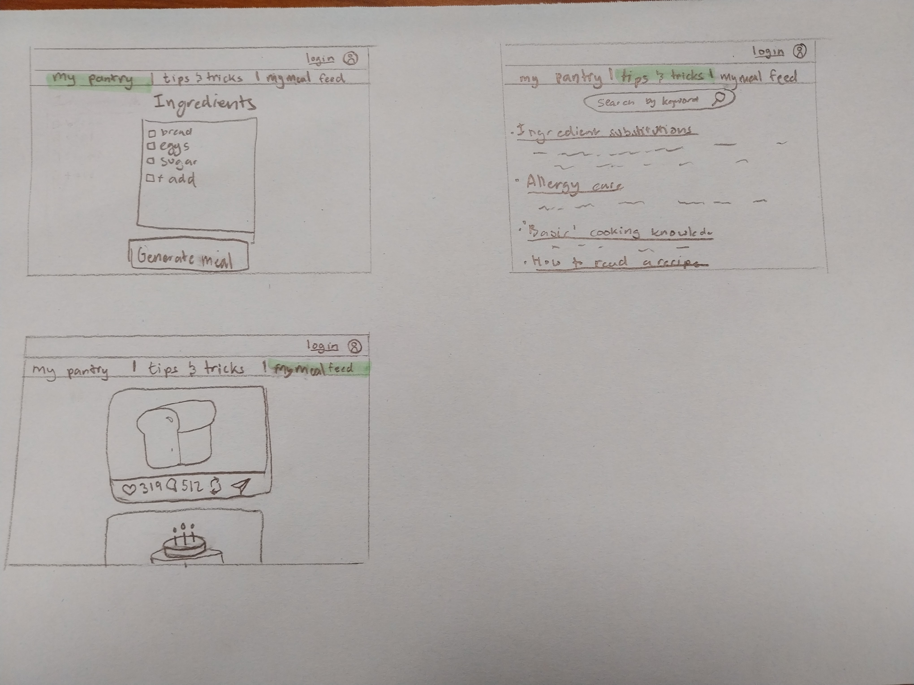

# TheCollegeKitchenSurvivalGuide

[My Notes](notes.md)

> [!NOTE]
>  This is a template for your startup application. You must modify this `README.md` file for each phase of your development. You only need to fill in the section for each deliverable when that deliverable is submitted in Canvas. Without completing the section for a deliverable, the TA will not know what to look for when grading your submission. Feel free to add additional information to each deliverable description, but make sure you at least have the list of rubric items and a description of what you did for each item.

> [!NOTE]
>  If you are not familiar with Markdown then you should review the [documentation](https://docs.github.com/en/get-started/writing-on-github/getting-started-with-writing-and-formatting-on-github/basic-writing-and-formatting-syntax) before continuing.

## 🚀 Specification Deliverable

> [!NOTE]
>  Fill in this sections as the submission artifact for this deliverable. You can refer to this [example](https://github.com/webprogramming260/startup-example/blob/main/README.md) for inspiration.

For this deliverable I did the following. I checked the box `[x]` and added a description for things I completed.

- [x] Proper use of Markdown
- [x] A concise and compelling elevator pitch
- [x] Description of key features
- [x] Description of how you will use each technology
- [x] One or more rough sketches of your application. Images must be embedded in this file using Markdown image references.

### Elevator pitch

Don't know what to cook? Poor? Limited Ingredients? No problem. Welcome to the College Kitchen Survival Guide. Simply enter the ingredients of your pantry to recieve simple recipe ideas! You can even rate recipes or share them with your friends in your recipe feed.

### Design

### Key features

- secure login
- ability to add/delete ingredients
- ability to generate recepes based on ingredients
- display of recipes
- ability to like, rate and share recipies

### Technologies

I am going to use the required technologies in the following ways.

- **HTML** - structuring of 3 pages. One for the login, one for the pantry ingredients, and one for recipe browsing
- **CSS** - styling and formatting of the pages
- **React** - displaying login, ingredients list, and recipe options
- **Service** - backend service for login and logout, displaying recipe options with and API
- **DB/Login** - stores users, ingredient lists, likes, ratings, and shares
- **WebSocket** - broadcasts as users like, rate, or share recipes

## 🚀 AWS deliverable

For this deliverable I did the following. I checked the box `[x]` and added a description for things I completed.

- [x] **Server deployed and accessible with custom domain name** - [My server link](thecollegekitchensurvivalguide.click).

## 🚀 HTML deliverable

For this deliverable I did the following. I checked the box `[x]` and added a description for things I completed.

- [x] **HTML pages** - one homepage, one for the ingredients (pantry), and one for the meal feed.
- [x] **Proper HTML element usage** - I used body, nav, main, header, and footer
- [x] **Links** - All pages link between each other
- [x] **Text** - Text in the descriptions of the recipies on mymealfeed and in other places as needed
- [x] **3rd party API placeholder** - Mymealfeed will use an API recipes instead of the 2 options I hard coded
- [x] **Images** - Images in mymealfeed
- [x] **Login placeholder** - Login with username and password
- [x] **DB data placeholder** - The list of ingredients, as well as comments made will be stored in a database
- [x] **WebSocket placeholder** - Ratings of the recipies, comments, and likes

## 🚀 CSS deliverable

For this deliverable I did the following. I checked the box `[x]` and added a description for things I completed.

- [x] **Header, footer, and main content body** - There is a header with the navigation elements, footer with my name and link to github, and the main body content respective to each page, all formatted nicely.
- [x] **Navigation elements** - In the header you can navigate between the home(login) page, mypantry, and myfeed. (plus if you click on the brand name it will take you to home! I love when pages have that feature)
- [x] **Responsive to window resizing** - They are flexible to different window sizes. Looked good to me.
- [x] **Application elements** - I made everything with satisfying colors and aligned how it makes sense to me. I'm particularly proud of the myfeed page and the cards I made there
- [x] **Application text content** - yep
- [x] **Application images** - Images on the myfeed page

## 🚀 React part 1: Routing deliverable

For this deliverable I did the following. I checked the box `[x]` and added a description for things I completed.

- [x] **Bundled using Vite** - Success.
- [x] **Components** - Still a little confused about what the definition of a component would be but I think it would be my app, the items in the mypantry list, and the cards for the recipe feed, as well as the components in the cards (pictures, ratings, etc)
- [x] **Router** - Routing between the home, mypantry, and mymealfeed

## 🚀 React part 2: Reactivity deliverable

For this deliverable I did the following. I checked the box `[x]` and added a description for things I completed.

- [x] **All functionality implemented or mocked out** - Login 'workshop put in a username and password, in the myPantry you can add, delete, and edit a list of ingredients, in the MyMealFeed I updated it so the cards have like a template with react instead of completely hardcoded. you can also like and comment. 
- [x] **Hooks** - Yes

## 🚀 Service deliverable

For this deliverable I did the following. I checked the box `[x]` and added a description for things I completed.

- [ ] **Node.js/Express HTTP service** - I did not complete this part of the deliverable.
- [ ] **Static middleware for frontend** - I did not complete this part of the deliverable.
- [ ] **Calls to third party endpoints** - I did not complete this part of the deliverable.
- [ ] **Backend service endpoints** - I did not complete this part of the deliverable.
- [ ] **Frontend calls service endpoints** - I did not complete this part of the deliverable.
- [ ] **Supports registration, login, logout, and restricted endpoint** - I did not complete this part of the deliverable.

## 🚀 DB deliverable

For this deliverable I did the following. I checked the box `[x]` and added a description for things I completed.

- [ ] **Stores data in MongoDB** - I did not complete this part of the deliverable.
- [ ] **Stores credentials in MongoDB** - I did not complete this part of the deliverable.

## 🚀 WebSocket deliverable

For this deliverable I did the following. I checked the box `[x]` and added a description for things I completed.

- [ ] **Backend listens for WebSocket connection** - I did not complete this part of the deliverable.
- [ ] **Frontend makes WebSocket connection** - I did not complete this part of the deliverable.
- [ ] **Data sent over WebSocket connection** - I did not complete this part of the deliverable.
- [ ] **WebSocket data displayed** - I did not complete this part of the deliverable.
- [ ] **Application is fully functional** - I did not complete this part of the deliverable.
